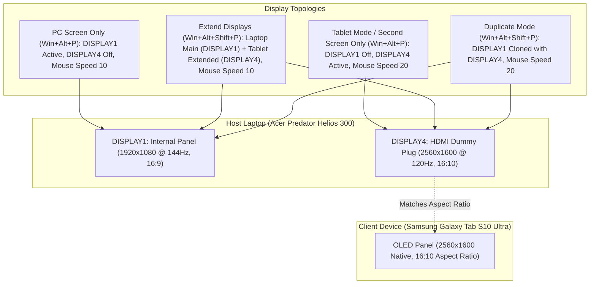

# Architecture

This document covers the shared library (`AllScripts/SharedHelpers.ahk`), the debounce pattern it provides as a reusable template, the bottom-right badge system, the local-path leak prevention setup, the Windows Task Scheduler boot architecture, DRM Video Streaming Mode, the master tray menu, the Sunshine/Moonlight display topology and watchdog lifecycle, and the Simple Sticky Notes multi-resolution layout engine.
Read this before adding a new hotkey or feature that needs any of these.

## Shared helpers (`AllScripts/SharedHelpers.ahk`)

Every script that needs one of these includes it with an **explicit** `%A_ScriptDir%` prefix:

```ahk
#Include %A_ScriptDir%\SharedHelpers.ahk
```

**Never a bare `#Include SharedHelpers.ahk`.**

- In AutoHotkey, a bare relative `#Include` path resolves against the *process's initial working directory* at load-time preprocessing, not necessarily the including script's own folder.
- This only "worked" historically for a bare `#Include *i LocalPaths.ahk` because of exactly how `StartupScript.ahk` happened to launch each script.
- Launch a script any other way (a manual reload from a shell with a different working directory, for instance) and a bare include can silently fail to resolve.

`SharedHelpers.ahk` also runs standalone as its own `StartupScript.ahk` tray entry, for quick Edit access (same reason `LocalPaths.ahk` does below).

- This uses a narrow exception to its own "no top-level directives" rule: a single `Persistent()` call at the top.
- `#Persistent` was a v1-only directive; in v2 it silently hangs the process at load time instead of erroring (confirmed empirically, see `Official Documentation/AHK-v1-to-v2-Migration-Notes.md` §18.1), and `Persistent()` is the runtime function call that replaces it.
- That's a pure lifecycle call rather than meaningful executable code, so it's a no-op for every `#Include`ing script (they all already stay alive via their own hotkeys/loops).
- It only actually matters for this standalone run.
- The explicit `%A_ScriptDir%\` form is immune to this regardless of how the script is launched.

**Important gotcha: include it *before* any hotkey definition.**

- AHK's auto-execute section ends at the first hotkey/hotstring definition, `Return`, or `Exit` encountered during a top-to-bottom load-time scan.
- That scan *skips over function bodies* entirely (recognized and deferred, never executed inline).
- v2 has no plain (non-hotkey) label at all in the v1 sense: every `SetTimer`/`OnMessage` target here (`RemoveBottomRightBadge`, `RemoveTimedToolTip`, etc.) is a real zero-parameter function, which the language requires and which auto-execute scanning correctly skips over.
- If you add a new `SetTimer` target to this file, it must be a function reference: v2 has no label-based `SetTimer` dispatch to fall back on.

### What's in the file, and why

- **`AcquireNamedMutex(mutexName, timeoutMs)` / `ReleaseNamedMutex(hMutex)`**: cross-process mutual exclusion via a real Win32 named mutex, not a file-existence convention.
  - A plain lock *file* can be left permanently stuck if the owning process crashes mid-critical-section.
    A named mutex cannot: Windows marks it "abandoned" and the next waiter picks it up cleanly.
  - The mutex name is a parameter, not hardcoded, specifically so this is reusable for *any* future resource needing cross-process exclusion, not just one.
  - Pick a distinct, descriptive name per logical resource (e.g. `"SkillsVaultLock_AHK_v1"`); every caller sharing that exact string, across however many separate processes, contends on the same kernel object.

- **`DebounceArmTimer` / `DebounceTryBeginCommit` / `DebounceEndCommit`**: the "settle after N ms of quiet, then act once" pattern. See the worked example below.

- **`ShowBottomRightBadge(msg, bgColorHex, displayMs := 0)` / `HideBottomRightBadge()` / `RemoveBottomRightBadge()`**
  - A colored toast, bottom-right corner, singleton: a second call while one is showing updates its color/text *in place*, never destroys/recreates or stacks.
    The window is created once and reused, so there is no visible gap between transitions.
  - `displayMs := 0` means "stay until the next Show/Hide call"; pass an explicit value for anything that should auto-dismiss on its own.
  - `HideBottomRightBadge()` dismisses immediately without a replacement badge: use it when real work has finished and there's nothing new worth telling the user.
    (See the Skills Vault commit phase in `BasicTasks.ahk`, which hides the "applying" badge on completion instead of showing a third, redundant "done" badge that would just repeat what was already shown at press time.)
  - See the badge section below for the DPI subtlety this encodes.

- **`ShowDualOptionPrompt(headingText, btn1Text, onBtn1, btn2Text, onBtn2, timeoutSec, footerText, ...)` / `DismissDualOptionPrompt()` / `IsDualOptionPromptActive()`**
  - Generic, modern rounded dual-action popup card anchored to the bottom-right toast position of the active monitor.
  - Fully parameterized and accepts either positional arguments with sensible defaults or a configuration object (`{ heading: "...", btn1Text: "...", ... }`).
  - Supports custom heading, button text and click callbacks, customizable button and background colors, optional live countdown timer, adaptive height calculation (omits bottom whitespace if footer is empty), automatic DPI scaling, outside-click dismissal, and `WM_SETCURSOR` hand cursor hover.

- **`ShowSkillsStatusBadge(msg)`**: thin color-mapping wrapper over `ShowBottomRightBadge`, specific to the Skills Vault feature (maps a `[LOCKED]`/`[UNLOCKED]`/`[AUTO]`/error-shaped message to its color, shown for 3000ms).
  - Shared by `BasicTasks.ahk` (manual toggle's fast-phase requested-state badge) and `BackgroundAutomations.ahk` (`WatchSkillsLock`'s post-commit confirmation) so the color convention is defined exactly once.

- **`ShowTimedToolTip(msg, displayMs)` / `RemoveTimedToolTip()`**: a native `ToolTip` auto-dismissed after N ms.
  - Use this for simple near-cursor feedback; use `ShowBottomRightBadge` when you want color/fixed-position control.

- **`PublishTrayMenuManifest(itemsArray)` / `HandleRemoteTrayMenuTrigger`**: publishes a script's custom tray-menu items so `StartupScript.ahk`'s master submenu can mirror them generically.
  - Call once per script, near the top of its auto-execute section:
  ```ahk
  PublishTrayMenuManifest([ ["Display Label 1", "TrayLabel1"]
                          , ["-"]
                          , ["Display Label 2", "TrayLabel2"] ])
  ```
  - Each script gets its own manifest file (`%A_Temp%\ahk_traymenu_<ScriptName>.txt`, keyed by that script's own filename), so sharing this one function across multiple processes is safe: there's no cross-process state beyond the convention of one manifest file per script.
  - **Separator Support**: An entry of `["-"]` or a string `"-"` serializes to `"-|"` in the manifest. When `StartupScript.ahk` reads the manifest, any item whose first token is `"-"` (or empty) calls a bare `.Add()` on that script's per-PID `Menu` object to insert a native Win32 horizontal separator line, grouping custom items cleanly.
  - If a script stops publishing items it previously did (a feature moved elsewhere, say), delete its stale manifest file once by hand.
    `StartupScript.ahk`'s `HandleRemoteTrayMenuTrigger` guard (a `Map.Has()` check against the fleet's registered handler names, replacing legacy v1 `IsLabel`) keeps a leftover manifest from raising an error dialog, but won't clean up the dead entry on its own.

  **Tray menu shape**, built by `StartupScript.ahk`'s `MenuBuild()`:
  - Each managed script's own submenu is deliberately minimal: `View Key History` / `Edit` / `Restart` / `Exit`, plus that script's own published items.
    Pause and Suspend are **not** per-script.
  - `StartupScript.ahk` exposes one global "Suspend Hotkeys" tray item (and matching `Win+ScrollLock` hotkey) that cascades a real Suspend-Hotkeys toggle to every managed script at once, leaving each script's own background timers/watchers running.
    That's why Suspend was chosen over Pause, which would freeze those too.
  - This replaces AutoHotkey's own native Suspend Hotkeys/Pause Script/Exit tray items (which only ever acted on the master script's own hotkeys, not the fleet) rather than sitting alongside them.
    So there is exactly one Suspend action and one Exit action, not two of each.
  - `StartupScript.ahk`'s own 4 hotkeys need no exemption mechanism at all (no legacy `Suspend, Permit`, no `#SuspendExempt`).
    `SuspendAllToggle` only ever posts to the managed child scripts, never to this master script's own window, so none of its hotkeys can ever actually become suspended.
  - "Restart" kills a script and relaunches it fresh without moving it to the Load submenu (unlike Exit).
    Useful when just one script needs a clean restart without a full fleet reload.

- **`ShowDRMStatusBadge(msg)`**: thin color-mapping wrapper over `ShowBottomRightBadge`, specific to the DRM Video Streaming Mode feature (maps `[ACTIVE]` to deep green `#1A6E3C`, and `[OFF]` to dark slate grey `#3A3D40`, shown for 3000ms).
- **`ShowBottomRightBadge(msg, bgHex, durationMs)`**: the core drawing function. Creates a borderless, captionless, non-activating (`+E0x08000000` / `WS_EX_NOACTIVATE`) GUI window with large white bold text on the requested background color. Dynamically queries monitor work area dimensions, places the GUI in the lower-right corner (offset 20px from right, 60px from bottom to clear taskbars), applies 210/255 transparency, and schedules auto-dismiss via a non-blocking `SetTimer`. If a badge is already active, resets the timer to avoid overlap.

### Color Palette Reference

| Color Name  | Hex Code | Semantic Meaning                                |
| ----------- | -------- | ----------------------------------------------- |
| Deep Red    | `8B0000` | Critical failure / hard stop / kill action      |
| Dark Red    | `6E1A1A` | Feature turned OFF (mute, stream close)         |
| Deep Green  | `1A6E3C` | Feature turned ON (unmute, stream start)        |
| Blue        | `1A4E6E` | Info / cycle state change                       |
| Slate Grey  | `3A3D40` | Passive status / dismiss                        |
| Amber       | `6E5A00` | Work in progress ("applying..."), not an error  |

- **Chromium browser lifecycle helpers (`GetTargetBrowsersForDRM`, `GetBrowserHardwareAcceleration`, `SetBrowserHardwareAcceleration`, `CloseBrowserGracefully`, `LaunchBrowserInstance`)**
  - Cross-cutting utility functions providing graceful session-preserving shutdown, preference parsing, and headless/GPU flag manipulation for Chromium-based browsers (Brave and Google Chrome).
  - Used by `BasicTasks.ahk` for the DRM Video Streaming Mode toggle.

- **Core Audio Microphone helpers (`ToggleMicrophoneMute`, `GetMicrophoneMute`, `SetMicrophoneMute`, `UpdateMicrophoneTrayIcon`)**
  - Native Windows Core Audio WASAPI COM interfaces (`IMMDeviceEnumerator` and `IAudioEndpointVolume`) called directly via Win32 `DllCall`.
  - Replaces legacy mixer and external dependencies (`nircmd.exe`, PowerToys VCM). Executes in under 5ms without spawning external processes.
  - Automatically targets both `eConsole` (0) and `eCommunications` (2) capture endpoints so Discord, Zoom, Teams, and browser calls are all muted in sync.
  - Integrates with `ShowBottomRightBadge` for instant DPI-scaled on-screen HUD toast notifications (deep red `#8B1A1A` for Muted, deep green `#1A6E3C` for Unmuted).
  - Drives a dynamic system tray indicator: when unmuted, the tray icon is completely hidden (`A_IconHidden := true`) for zero clutter. When muted, a dedicated high-contrast white microphone icon with a vivid neon-red diagonal slash (`AutoHotkey Companion Files\mic_muted.ico`) appears in the notification area (`A_IconHidden := false`, `A_IconTip` set to the persistent hover text).
  - Left-clicking the muted tray icon immediately unmutes the microphone and dismisses the icon.
  - A lightweight 1500ms background watcher (`WatchMicrophoneMuteState` in `BasicTasks.ahk`) quietly detects external hardware/system mute changes and keeps the tray icon synchronized without firing disruptive toasts.
  - `StartupScript.ahk`'s `TrayIconRemove` explicitly exempts `BasicTasks` so mouseover events over the notification area do not wipe out the active mute icon.

- **`RunSilentPowerShell(scriptPath, args := "")` and `RunSilentProcess(targetExe, args := "")`**
  - Launches PowerShell scripts or console binaries with zero visible window on Windows 11.
  - Prefers `run_silent.exe` (a C# GUI subsystem launcher built with `CREATE_NO_WINDOW = 0x08000000` and `UseShellExecute = false`).
  - Completely prevents the Windows Console Subsystem (`conhost.exe` and Windows Terminal) from allocating or flashing a top-level console window onto the desktop.
  - Used for Simple Sticky Notes geometry repositioning (`apply_ssn_layout.ps1`), mouse speed synchronization (`set_normal.ps1`, `set_fast.ps1`), ADB tablet intent dispatches, and WSL ext4 disk management.

`MountExt4Ssd`/`UnmountExt4Ssd` do **not** live here: the ext4 SSD feature (hotkeys, auto-mount watcher, tray items, and these two functions) is fully self-contained in `AllScripts/Ext4SsdManager.ahk`, matching the single-feature-script convention `Brightness.ahk`/`ClosePrograms.ahk` already use.
They only ever lived in this shared file because two other generic scripts happened to both need them, not because the feature is genuinely cross-cutting the way the debounce pattern or badge system are.

## The debounce pattern

**The problem this solves**: a hotkey whose real work is slow (in this repo's case, an `icacls` sweep across 14 folders taking ~2.3-3.5 seconds) needs instant visual feedback on every press.
But it should only actually do that slow work once the user stops pressing: a rapid burst of presses should show a toast every time but commit only the *last* one.

Each feature owns its own state as three plain globals: a pending-value variable, a busy flag, and an interval, passed into the shared functions by name/`&var`.
Nothing in `SharedHelpers.ahk` stores any feature-specific state itself.

```ahk
global g_MyFeatureDebounceMs := 2000   ; 2000ms is the default this codebase
                                        ; uses everywhere the pattern appears:
                                        ; keep new features consistent unless
                                        ; you have a specific reason not to.
global g_MyFeaturePendingValue := ""
global g_MyFeatureCommitBusy := false

; Fast phase: the actual hotkey/tray target. Never blocks.
MyFeatureFastPhase() {
    global g_MyFeaturePendingValue, g_MyFeatureDebounceMs

    ; ... cycle/update g_MyFeaturePendingValue however your feature needs ...
    ; ... show instant feedback, e.g. ShowBottomRightBadge(...) ...

    DebounceArmTimer(MyFeatureCommit, g_MyFeatureDebounceMs)
}

; Commit phase: an ordinary zero-parameter function, reached only via the timer armed above.
; Legacy v1's original shape used a label here (real SetTimer/Gosub targets in v1 could be either), but v2's
; SetTimer requires a real function reference: there is no remaining reason for a commit phase to ever
; be a label (see `Official Documentation/AHK-v1-to-v2-Migration-Notes.md` §11 for the full history of this specific change).
MyFeatureCommit() {
    global g_MyFeaturePendingValue, g_MyFeatureCommitBusy, g_MyFeatureDebounceMs

    if !DebounceTryBeginCommit(&g_MyFeatureCommitBusy, MyFeatureCommit, g_MyFeatureDebounceMs)
        return

    snapshotValue := g_MyFeaturePendingValue
    ; ... do the real (slow) work using snapshotValue ...

    DebounceEndCommit(&g_MyFeaturePendingValue, snapshotValue, &g_MyFeatureCommitBusy, MyFeatureCommit, g_MyFeatureDebounceMs)
}
```

**Why this is correct, precisely:**

- `DebounceArmTimer` uses AHK's own documented `SetTimer` "Reset" behavior: a negative period runs once after N ms, and calling `SetTimer` again on an already-pending target cancels that countdown and starts a fresh one rather than stacking a second pending firing.
  So only the *last* press in any rapid run ever reaches the commit label, and only once the interval elapses with zero further presses.
- `DebounceTryBeginCommit`'s busy-guard is defense-in-depth: AHK's timer engine already guarantees at most one concurrently-running instance of a given timer's target, so this should never actually trigger in practice.
- `DebounceEndCommit`'s reconciliation is the subtle but important part:
  - If a press lands *while the commit is already running* (not just within the debounce window, but seconds later while the real work is genuinely mid-flight), that intent can't safely cancel already-dispatched work, so it doesn't try.
  - Instead, comparing the live pending value against a snapshot taken before the slow work started detects the newer press and re-arms one more time, so it gets applied immediately after, never silently dropped.
- **Real commits can't be cancelled once started.** If your feature's "real work" is an external process launch (like `RunWait`), killing it partway through to honor a newer press risks leaving it in a half-applied state, worse than letting it finish and following up immediately after.
  Don't try to make commits interruptible; let the reconciliation tail handle catching up instead.

**Why plain global variables plus `&var` by-reference parameters, not a bound-function/closure approach:**

- AutoHotkey v2 uses `&var` for by-reference parameters (replacing legacy v1 `ByRef`), used throughout the debounce helpers (`DebounceTryBeginCommit`, `DebounceEndCommit`) exactly as before.
- Legacy v1 dynamic `%var%`-label `Gosub` dispatch (used for old tray manifest handlers) has no v2 equivalent: v2 requires a real function reference wherever v1 accepted a label or a constructed label-name string. Every timer/dispatch target in this pattern is now an ordinary function reference registered in a `Map()`, not a string.
- A `Func().Bind()` closure-per-feature approach was considered and rejected: it would need rebuilding the bound object on every re-arm (an object-target timer is deleted after firing, unlike a function-reference timer which just goes `Off` and can be reused), for no benefit over the existing plain-globals-plus-`&var` shape every feature in this codebase already uses.

## The bottom-right badge system

Colors follow a simple convention: pick from these when adding a new message, or extend `ShowSkillsStatusBadge` (a `SharedHelpers.ahk` wrapper over `ShowBottomRightBadge` that maps a `[LOCKED]`/`[UNLOCKED]`/`[AUTO]`/error message to its color automatically, shared by both `BasicTasks.ahk`'s manual toggle and `BackgroundAutomations.ahk`'s auto watcher) if you need new ones:

| Color       | Hex      | Meaning                                         |
| :---------- | :------- | :---------------------------------------------- |
| Deep green  | `1A6E3C` | Unlocked / open / permissive state              |
| Deep red    | `8B1A1A` | Locked / restricted state                       |
| Deep blue   | `0D4F8B` | Automatic / focus-driven state                  |
| Amber       | `6E5A00` | Work in progress ("applying..."), not an error |
| Dark orange | `7A3B00` | Error                                           |

**The DPI subtlety `ShowBottomRightBadge` encodes:**

- Under Windows display scaling above 100%, AutoHotkey GUI coordinate space without `-DPIScale` is DPI-virtualized: a GUI's rendered size can be inflated by the DPI scale factor relative to what was requested, even though `x`/`y` position values pass through unscaled.
- **The fix**: the `Gui` is created with `-DPIScale`, which maps every coordinate and dimension AHK sets or reads for that Gui 1:1 to physical screen pixels: the inflation problem is avoided at the root instead of being measured and corrected after the fact.
- Because sizing is physical-pixel-exact, the badge can be sized directly from a live GDI `DrawTextW` (`DT_CALCRECT`) measurement of the actual message text, taken fresh on every call, rather than created at a fixed nominal size and corrected afterward. This is also what makes the auto-sizing pill shape possible: badge width tracks the measured text width, falling back to a word-wrapped box only for messages too long to fit inline.
- `GetToastTargetMonitor()` re-resolves which monitor is under the cursor on every call, and the work area (`MonitorGetWorkArea()`) is recalculated every call too: together these keep the badge anchored to the monitor actually in use (and its exact bottom-right work-area corner) across a Sunshine/Moonlight display-topology switch, rather than to a monitor index that goes stale the moment the active display changes.
- If you copy this pattern for a new kind of popup, keep `-DPIScale` plus a live text measurement on every call; don't fall back to a fixed nominal size with an after-the-fact position correction, which can't follow a monitor change or a message-length change without recomputing everything anyway.

**Create once, update in place: no destroy/recreate:**

- Destroying and rebuilding the whole `Gui` on every call (`Destroy` -> `Sleep` -> rebuild) produces a visible blank gap between badge transitions.
- `ShowBottomRightBadge` instead creates the window once (guarded by a `static created` flag) and every later call just updates `badgeGui.BackColor`, updates `badgeTextCtl.Text`, and re-`Show`s if hidden: no destroy, no sleep, no rebuild, so transitions are instant.
- Dismissal (both the timer-driven path and the explicit `HideBottomRightBadge()`) uses `badgeGui.Hide()`, never `Destroy`, so the window stays alive and ready for the next instant update.
- Keep this create-once/update-in-place shape for any similar popup; reintroducing Destroy/Sleep brings the visible gap back.

**The legacy v1 `Hwnd`-vs-`v` GUI hang does not apply in v2:**

- On legacy AHK v1.1, adding a text control inside a user-defined function using the `v` variable option could hang the thread.
- **v2 has no equivalent bug and no `Hwnd`-vs-`v` distinction**: `GuiObj.AddText(...)` (and every other `.Add*()` method) always returns the real `GuiControl` object directly, from any calling context, function or auto-execute alike (confirmed empirically, see `Official Documentation/AHK-v1-to-v2-Migration-Notes.md` §8). `ShowBottomRightBadge` in `SharedHelpers.ahk` now stores that returned control object directly in a `global` and calls `.Text := newText` on it: no HWND indirection needed at all.
- If you add a new Gui-based helper function to this file, just keep the object `.Add*()` returns; there is nothing left to work around here.

## Path-leak prevention

This repo is **public** (`Arora-Sir/AutoHotKey-Windows-Scripts`). Three files hold real local machine paths and are gitignored, each with a tracked `.example` counterpart carrying generic placeholders:

- `AllScripts/LocalPaths.ahk`
- `AllScripts/PersonalKeywords.ahk`
- `AllScripts/PowerShell/ssd_config.json`

Two independent layers guard against a real path leaking into a tracked file anyway:

1. **`.githooks/pre-commit`** (local, tracked, fully generic: derives this machine's username/computer name from the environment at commit time rather than hardcoding them, since hardcoding them into a tracked file would itself be the exact leak this prevents).
   - Hard-blocks committing any of the 3 real config files if ever force-staged.
   - Hard-blocks any *other* staged file containing this machine's username, computer name, or a generic per-user Windows profile path pattern.
   - Warns (non-blocking) if a real config file has grown a variable/key its tracked `.example` hasn't caught up to yet.
   - Activated via a **local-only** git config: `git config core.hooksPath .githooks` (not itself tracked: a fresh clone needs to run this once).
2. **`.github/workflows/no-local-path-leak.yml`**: a server-side backstop, since the local hook alone is bypassable (`--no-verify`, or simply never configuring `core.hooksPath`).
   Can only check the same generic per-user Windows profile path pattern, never this machine's specific values (a CI runner has no legitimate way to know them, and a tracked workflow file embedding them would defeat the purpose).

A local, gitignored `CLAUDE.md` at the repo root carries additional contributor/tooling notes specific to this machine (not tracked, so not reproduced here).

## Cross-file state via a shared marker file

Not every shared state goes through `SharedHelpers.ahk`. `AllScripts/SunshineDisplayWatchdog.ahk` coordinates the Sunshine fast/normal mouse-speed state through plain marker files, since Sunshine's own prep-cmd hooks: `AllScripts/PowerShell/Sunshine/set_fast.ps1` (`do`) / `set_normal.ps1` (`undo`), run directly by Sunshine on stream start/end, independent of any AHK script: already owned this convention before the AHK-side manual toggle existed.

- **`.fast_since`**: the marker's mere existence means "fast mode"; its content distinguishes *why*: empty means a real Sunshine session set it (`set_fast.ps1`), `"manual"` means the Win+Alt+P toggle did.
- **`sunshine_manual_switch.flag`** (in `%A_Temp%`, separate from `.fast_since`): a 20-second-bounded grace window armed by manual toggles. `SunshineDisplayWatchdog.ahk` skips its sunshine.log/Tailscale disconnect checks entirely while this flag is younger than 20s. Those checks answer "did the old session end," not "has the user had time to open Moonlight yet," and would otherwise revert a deliberate toggle before the user connects. Bounded rather than indefinite, so toggling to tablet mode and never streaming does not permanently disable the disconnect checks. See that file's own `MANUAL OVERRIDE` comments for the full reasoning.
- **`.session_quit`**: written by `set_normal.ps1` only when Sunshine's own `undo` prep-cmd hook fires (an explicit Moonlight quit), never by the watchdog. Lets `SunshineDisplayWatchdog.ahk` short-circuit straight to a ~1.5s display restore instead of waiting out the normal multi-poll debounce/settle window that exists to avoid reacting to a transient back-gesture/app-switch.

## Why Display Mode hotkeys are bound in SunshineDisplayWatchdog.ahk

`SunshineDisplayWatchdog.ahk` binds `Win+Alt+P` (`#!p`) to toggle between PC Screen Only and Tablet Only, and `Win+Alt+Shift+P` (`#!+p`) to toggle between Extend and Duplicate. Previously, alternate bindings (`Ctrl+Shift+P` and `Win+Shift+P`) were tested in an attempt to trigger the toggle remotely from the Galaxy Tab S10 Ultra during a Moonlight session without walking over to the PC:

- Android intercepts recognized modifier-key combos (Alt+Tab, the Windows key, Ctrl+S, etc.) at the OS level before any app (Moonlight included) ever sees them, redirecting to Android's own system actions instead. This is a documented, still-open limitation in Moonlight Android (see its GitHub issues #840 and #975), not something fixable from this repo's side.
- This applies to both a physical/case Bluetooth keyboard and the tablet's own on-screen Samsung Keyboard: the latter's own Ctrl+A/Ctrl+C-style "shortcuts" are local Android text-editing actions, not genuine key events that would traverse to a remote session at all.
- Alternate keybinds like `Ctrl+Shift+P` also collided with universal editor shortcuts (Command Palette in VS Code / Antigravity). `Win+Shift+P` is dedicated to Bitwarden Vault (Password Manager) in `PersonalKeywords.ahk`, leaving `Win+Alt+P` as the dedicated host display toggle.
- The confirmed-working remote path remains touching the PC's tray items (PC Screen Only, Tablet Only, Extend Displays, Duplicate Displays under `SunshineDisplayWatchdog.ahk`'s dedicated tray menu) directly through the Moonlight stream, since that involves no keyboard at all.

## Windows Task Scheduler boot architecture

The AutoHotkey fleet is launched on Windows boot via a dedicated scheduled task named `"AHK Startup Script"`, managed by `setup_startup_task.ps1` (with Explorer-friendly 1-click batch wrappers `Install_Startup_Task.bat` and `Uninstall_Startup_Task.bat`).

- **30-Second Logon Delay (`PT30S`)**:
  - Task Scheduler is deliberately chosen over Windows Startup (`shell:startup` or registry `Run` keys) because of startup race conditions.
  - On modern Windows 10/11 installations, audio endpoints, network adapters (Tailscale/Wi-Fi), graphics drivers, and the Windows Explorer shell initialize concurrently across multiple worker threads at user logon.
  - Launching the AHK fleet instantaneously on logon causes tray icons to fail to register with `Shell_NotifyIcon`, display topology queries to return incomplete monitor arrays, and background network checks to throw spurious errors.
  - A 30-second delay (`PT30S`) ensures the entire desktop subsystem has settled before `StartupScript.exe` executes.

- **Elevated Task Creation vs. Standard User Execution (`RunLevel Limited`)**:
  - Registering or modifying tasks in the Task Scheduler root (`\`) requires Administrator privileges. Therefore, `Install_Startup_Task.bat` and `setup_startup_task.ps1` self-elevate via PowerShell `Start-Process -Verb RunAs` if executed un-elevated.
  - However, the task itself is registered with `Principal.RunLevel = Limited` under the user's standard account (`$env:USERNAME`).
  - Running as a standard user is critical: running AHK elevated would trigger UAC confirmation prompts on every boot, isolate window messages (UIPI blocks un-elevated apps from sending messages to elevated windows), and alter file virtualization paths.

- **Battery Resilience & Infinite Execution**:
  - Registered with `Settings.AllowStartIfOnBatteries = $true` and `Settings.DontStopIfGoingOnBatteries = $true`.
  - Windows Task Scheduler defaults to stopping background tasks when a laptop disconnects from AC power; these flags guarantee continuous background automation on laptops.
  - `ExecutionTimeLimit = PT0S` (zero timeout) prevents Windows from terminating the fleet after the default 3-day task limit.

- **Recompilation & Relaunch Integration**:
  - `build_startup_exe.ps1` checks for the existence of `"AHK Startup Script"` in Task Scheduler.
  - When invoked with `-Relaunch` (or when triggered via the `StartupScript` submenu's "Recompile & Relaunch" item), it first stops `StartupScript.exe` to release file locks, compiles a fresh binary via `Ahk2Exe`, and triggers `schtasks /run /tn "AHK Startup Script"` to restart the master process seamlessly in the user's active session without command prompt flashes. If the scheduled task is not registered on that machine, it gracefully falls back to `Start-Process`.

## DRM Video Streaming Mode architecture

When streaming desktop video to a tablet (such as Samsung Galaxy Tab S10 Ultra) or handheld device via Moonlight and Sunshine, hardware-accelerated video playback on Chromium browsers (Brave, Google Chrome) results in a black video screen for DRM-protected content (Netflix, Amazon Prime Video, Disney+ Hotstar, Udemy, etc.).

- **The Root Cause**:
  - Protected media playback utilizes Windows Hardware DRM / Protected Media Path (PMP) surfaces within Chromium's GPU process.
  - Desktop duplication APIs (Direct3D Desktop Duplication / DXGI) used by Sunshine and Moonlight cannot capture protected Direct3D surfaces while GPU compositing is active, outputting solid black frames for the video area while subtitles and browser UI remain visible.

- **The Architecture Solution (`BasicTasks.ahk` + `SharedHelpers.ahk`)**:
  - Rather than switching monitor topologies or disabling system-wide virtual display drivers, the toggle operates strictly at the browser application level via `ToggleDRMStreamingMode()`:
  1. **Target Browser Resolution**: Detects whether Brave or Chrome is active. When actively on Brave or Chrome (via immediate focus, recent focus tracking across tray interactions, or topmost unminimized window in desktop Z-order), the toggle acts strictly on that particular browser instead of parallel-restarting both. If neither browser is active, it halts gracefully with a notification badge without disrupting background processes.
  2. **Graceful Shutdown (`CloseBrowserGracefully`)**: Sends `WM_CLOSE` to all top-level windows (`WinClose("ahk_id " . this_id)`). This allows Chromium to write open tabs, history, and active sessions to disk cleanly. Lingering background watcher processes are terminated to release file locks on Chromium profile files.
  3. **Atomic `Local State` Modification (`SetBrowserHardwareAcceleration`)**: Reads Chromium's root `Local State` JSON file in UTF-8. Atomically sets `"hardware_acceleration_mode": {"enabled": false}` (and updates `hardware_acceleration_mode_previous`). Writes to a `.tmp` file and performs an atomic replace (`FileMove(tmpPath, targetPath, 1)`) to eliminate corruption risks.
  4. **Targeted Relaunch (`LaunchBrowserInstance`)**: Relaunches the browser with:
     - `--disable-gpu`: Disables the GPU process, forcing software rasterization for video presentation surfaces.
     - `--restore-last-session`: Automatically restores all previously open tabs without requiring manual user intervention.
     - `--disable-session-crashed-bubble`: Suppresses the "Restore pages? Chromium didn't shut down correctly" warning bubble.
  5. **Status Badge & Tray Menu Sync**: Displays `ShowDRMStatusBadge(...)` with explicit `[ON]` / `[OFF]` indicators (e.g. `[ON] Graphics Accel: Brave (Normal GPU Mode)`) and updates the tray menu item label dynamically via `UpdateDRMTrayStatus` (`Graphics Accel: Brave (ON) / Chrome (OFF)`).
  6. **Reversion**: Clicking the toggle again reverses the JSON preference (`"enabled": true`), closes the browser gracefully, and relaunches with normal GPU hardware acceleration restored.

## Master tray menu architecture

`StartupScript.ahk` provides a centralized system tray interface for the entire script fleet, ensuring that multiple background scripts do not clutter the Windows notification area with redundant icons.

- **Unified Single Tray Icon**:
  - On startup and resolution changes, `TrayIconRemove` iterates through all child script processes and calls `Shell32\Shell_NotifyIcon` with `NIM_DELETE` on their notification handles.
  - The master script keeps only its own single tray icon active. Mouseover (`WM_MOUSEMOVE` `0x200`) proactively cleans up any ghost icons left by terminated child processes.

- **Click Action Dispatch (`AHK_NOTIFYICON`)**:
  - Tray interactions are intercepted via `OnMessage(0x404, AHK_NOTIFYICON)`:
    - **Left-Click (`WM_LBUTTONUP` `0x202`) & Right-Click (`WM_RBUTTONUP` `0x205`)**: Both left-click and right-click open the master tray context menu (`A_TrayMenu.Show()`).
    - **Hover Tooltip (`WM_MOUSEMOVE` `0x200`)**: Displays a dynamic sorted list of all active scripts and cleans up any ghost tray icons.

- **Menu Hierarchy & Pinned Scripts**:
  - **Pinned Scripts**: Scripts listed in `PinnedScripts` (`BasicTasks`, `PersonalKeywords`, `SunshineDisplayWatchdog`) are rendered directly at the top level of the master tray menu for immediate 1-click submenu access.
  - **Additional Scripts Submenu**: All remaining active background scripts (`BackgroundAutomations`, `Brightness`, `ClosePrograms`, `Ext4SsdManager`, `HotkeyHelp`, `LocalPaths`, `SharedHelpers`, `Watchdog`) are cleanly consolidated into an expandable "Additional Scripts" submenu, preventing vertical menu overflow.
  - **Child Submenu Structure**: Each managed script submenu provides standard management actions (`View Key History`, `Edit`, `Restart`, `Exit`), followed by a horizontal separator line and any custom items published by that script.
  - **Global Actions**: Positioned at the bottom of the master menu: "Suspend Hotkeys" (global cascade toggle) and "Exit". Fleet maintenance actions ("Reload All", "Recompile & Relaunch") are housed inside the "Additional Scripts -> StartupScript" submenu to keep the top-level tray menu concise.

- **Dynamically-Labeled Mirrored Items (a required third registration point)**:
  - `PublishTrayMenuManifest`/`RegisterTrayMenuHandler` (see `SharedHelpers.ahk`) are enough for a mirrored item whose label text never changes: an exact string match against the manifest always finds it.
  - An item whose label changes with live state (`"Graphics Accel: Brave (ON)..."`, `"ShareX Image Effects: ON/OFF"`) needs three more things wired up here in `StartupScript.ahk`, or it silently breaks after exactly one toggle.
  - A tracked `g_CurrentBasicTasks<Feature>Item` global holds the label last seen. `MenuBuild()`'s per-script manifest loop captures that label into it at build time. `UpdateBasicTasksMenuLabels()` (fired on every tray icon click, right before `A_TrayMenu.Show()`) renames the live menu item against that tracked value so the displayed text and the item's own bound name both stay current. `RemoteMenuCommand()`'s match test carries a substring fallback clause as a second line of defense.
  - Skipping any of these leaves the displayed label frozen at whatever `MenuBuild()` last saw. Once the underlying manifest value has since changed, the next click still carries that stale frozen label, which no longer matches the manifest's current line, so the click silently dispatches nothing: no error, no badge, nothing.
  - `g_CurrentBasicTasksDrmItem` (Graphics Accel), `g_CurrentBasicTasksEffectsItem` (ShareX Image Effects), and `g_CurrentSunshineMouseSpeedItem` (Mouse Speed) are the three current instances of this pattern. Add a new one the same way for any future state-in-label mirrored item.

## Sunshine & Moonlight display topology and watchdog lifecycle architecture

This system orchestrates high-performance, low-latency remote desktop streaming from the host laptop to a Samsung Galaxy Tab S10 Ultra using Sunshine, Moonlight, and an HDMI dummy plug, managed entirely by `SunshineDisplayWatchdog.ahk` with a dynamic checkmark tray interface in `StartupScript` and direct hotkeys (`Win+Alt+P` and `Win+Alt+Shift+P`).

### Hardware topology & display modes



### Complete lifecycle, race conditions, and disconnect flap hazard

```mermaid
sequenceDiagram
    autonumber
    actor User as User (Tablet / Laptop)
    participant Moonlight as Moonlight (Tab S10 Ultra)
    participant Sunshine as Sunshine Server (Windows Service)
    participant Watchdog as SunshineDisplayWatchdog.ahk (Interactive Session & Display Manager)
    participant Win11 as Windows 11 Display Engine (DisplaySwitch & SetDisplayConfig)

    Note over User,Win11: Phase 1: Initiation & Streaming
    User->>Win11: Win+Alt+P or Tray Menu (Toggle Tablet Mode)
    Win11-->>User: DisplaySwitch /external (DISPLAY4 2560x1600 Active, Laptop Screen OFF, mouse speed boosted to 20 and 20s manual grace window armed directly by the toggle itself)
    User->>Moonlight: Open Desktop Stream
    Moonlight->>Sunshine: Connect Stream (Tailscale 100.x.y.z)
    Sunshine->>Sunshine: DXGI Desktop Duplication on DISPLAY4 (2560x1600 @ 60/120Hz)
    Sunshine->>Watchdog: Log "CLIENT CONNECTED"
    Watchdog->>Watchdog: Clears manual grace flag (mouse speed was already boosted at the manual toggle above; ForceFast only re-boosts here for a resumed session where the marker was absent)

    Note over User,Win11: Phase 2: Disconnect vs. Transient Back Button Flap
    User->>Moonlight: Press Android Back / Switch Tablet App / Screen Timeout
    Moonlight->>Sunshine: Disconnect Session
    Sunshine->>Watchdog: Log "CLIENT DISCONNECTED"
    Sunshine->>Sunshine: Start Undo Cmd countdown (5s-20s exit timeout)

    alt Explicit Quit (Sunshine's own undo hook fires)
        Sunshine->>Watchdog: set_normal.ps1 (Sunshine's undo prep-cmd, not a Watchdog action) writes .session_quit
        Watchdog->>Win11: Instant restore (~1.5s): bypasses the debounce/settle window below entirely
    else Aggressive Immediate Trigger (< 3s)
        Watchdog->>Win11: DisplaySwitch /internal (Switches back to DISPLAY1 1080p)
        Win11-->>Watchdog: Internal Screen ON, DISPLAY4 Deactivated
        Note over User,Win11: Hazard: User returns to Moonlight after 3 seconds
        User->>Moonlight: Re-tap Desktop Stream
        Moonlight->>Sunshine: Connect while Windows is on DISPLAY1 (1080p)
        Sunshine->>Sunshine: DXGI tries to capture DISPLAY1, races display topology, or hangs in duplicate window!
    else Reconnect within Settle Window (< 3s or Debounce Window)
        User->>Moonlight: Re-tap Desktop Stream within settle grace
        Moonlight->>Sunshine: Re-connect before Watchdog switches display
        Sunshine->>Sunshine: DISPLAY4 still active at 2560x1600, stream resumes smoothly without hang!
    end

    Note over User,Win11: Phase 3: Hardware Lid-Open Safety Net
    User->>Host: Physically lift laptop lid while streaming
    Host->>Watchdog: WM_DISPLAYCHANGE (0x007E) triggered by DISPLAY1 wake
    Watchdog->>Win11: DisplaySwitch /internal (Restores PC Screen Only, mouse speed 10 if monCount <= 1)
```

### State matrix and trade-off analysis

| State / Event | Trigger | Intended Outcome | Potential Hazard / Consequence | Design Mitigation |
| :--- | :--- | :--- | :--- | :--- |
| **Manual Tablet Toggle** | `Win+Alt+P` / Tray Menu | Switches to `DisplaySwitch.exe /external`, mouse speed 20. | Sunshine log tail still shows old `CLIENT DISCONNECTED`. | 20s manual grace window (`sunshine_manual_switch.flag`) prevents watchdog revert. |
| **Manual Laptop Toggle** | `Win+Alt+P` / Tray Menu | Switches to `DisplaySwitch.exe /internal`, mouse speed 10 in 0 ms. | Stale markers could cause speed sticking. | Win32 speed 10 assertion + clearing `.fast_since`. While stream is idle on `topo == 1`, watchdog enforces speed 10. |
| **Extend / Duplicate Toggle** | `Win+Alt+Shift+P` / Tray Menu | Toggles between Extend (`DisplaySwitch.exe /extend`, speed 10) and Duplicate (`DisplaySwitch.exe /clone`, speed 20). | Direct `/extend` from PC Only or Duplicate fails on hybrid dual-GPU systems because the discrete GPU display pipe is asleep or clone-locked. | Closed-loop handshake: if coming from `topo == 1` or `topo == 2`, `SwitchToExtendMode` switches to `/external`, dispatches ADB wake and connect intent to tablet Moonlight, waits for Sunshine `CLIENT CONNECTED` confirmation, and only then applies `/extend`. |
| **Moonlight Connect** | Moonlight app taps "Desktop" | Sunshine captures active display (default mirror on `DISPLAY1` or headless `DISPLAY4`). | Auto-switching display topology on connect races with Sunshine DXGI and hangs. | Connect-side display topology remains explicit; watchdog dynamically boosts mouse speed to 20 across PC Screen Only, Duplicate, and Tablet Only modes during active streaming. |
| **Transient Disconnect** | Android back gesture / app switch | Stream pauses. | Mouse speed stuck fast on laptop screen. | Watchdog restores mouse speed 10 on PC Screen Only, Duplicate, and Extend modes within 1.5s, without disrupting display topology. |
| **Permanent Disconnect** | User finishes work, closes Moonlight | Sunshine session ends; mouse speed 10 restored. | Speed remains 20 if disconnect missed. | Multi-signal detection: Sunshine undo hook (`.session_quit`), Sunshine log (`CLIENT DISCONNECTED`), Tailscale peer offline check, and 8h ceiling. |
| **Explicit Quit** | Sunshine's own undo prep-cmd hook fires (`set_normal.ps1`) | `.session_quit` written, mouse speed restored in 1.5s. | Delayed recovery. | Watchdog consumes `.session_quit` on the next tick, resets streaks, and updates tray status. |
| **Lid Open While Streaming** | User opens laptop lid | Immediate return to Laptop Mode (`DisplaySwitch.exe /internal`), mouse speed 10. | Infinite loop if display change re-triggers lid handler, or breaking multi-monitor setups. | Guard 1 (4s manual toggle lock) + Guard 2 (only acts if `monCount <= 1 && topo != 2 && topo != 4`). |
| **System Resume from Wake** | Win32 `WM_POWERBROADCAST` (`0x0218`) | Triple-wave recovery (500ms, 2000ms, 4000ms) restores laptop display mode and mouse speed 10 if second screen remained active. | Slow GPU bus re-enumeration after Modern Standby can drop single-shot display switches. | Triple-wave staggered timers guarantee GPU driver settles before final confirmation pass. |
| **Workstation Session Unlock** | Win32 `WM_WTSSESSION_CHANGE` (`0x02B1`, `WTS_SESSION_UNLOCK` `wParam=8`) | Restores laptop display mode if second screen active; recycles keyboard hook. | User wakes laptop, unlocks with biometric/PIN while virtual display is still engaged, or keyboard hook hangs. | Immediate display state check on session unlock + keyboard hook refresh ensuring hotkeys respond. |

### Closed-loop Extend handshake and stream teardown lifecycle

On hybrid dual-GPU laptops (Intel UHD Graphics driving `DISPLAY1` and dedicated NVIDIA GeForce GTX 1650 Ti driving `DISPLAY4`), switching directly from PC Screen Only (`topo == 1`) or Duplicate Displays (`topo == 2`) to Extend Displays (`DisplaySwitch.exe /extend`) fails silently. Windows 11 requires an active video streaming consumer established on the secondary discrete GPU display pipe before it can extend the desktop across both adapters.

The automated handshake enforces a closed-loop sequence with mandatory stream teardown:

1. **Topology verification**: The system queries `GetCurrentDisplayTopology()`. If already in Second Screen Only (`8`) or Extend (`4`), it executes `DisplaySwitch.exe /extend` directly.
2. **Surface activation and stream teardown**: If starting from PC Screen Only or Duplicate mode, the system invokes `SwitchToTabletOnlyMode()` (`DisplaySwitch.exe /external`). If an existing tablet streaming session was active, the display disconnects from the laptop first. This disconnect causes Sunshine to release the previous DirectX Desktop Duplication (DXGI) adapter capture context.
3. **Log baseline marking**: The watchdog records the current byte length of `sunshine.log` (`g_ExtendTargetLogSize`) so historical connection markers are ignored.
4. **Automated tablet wake and client launch**: An ADB command dispatched over Tailscale wakes the Galaxy Tab S10 Ultra and launches Moonlight directly into the desktop stream via `com.limelight/.ShortcutTrampoline`.
5. **Connection handshake polling**: A 500ms non-blocking timer (`SunshineDisplay_WaitTabletConnectForExtend`) polls `sunshine.log` for a fresh `CLIENT CONNECTED` record beyond the baseline marker.
6. **Decoding surface stabilization**: Once `CLIENT CONNECTED` is confirmed, the system waits 1000ms for tablet video decoding to stabilize.
7. **Extend execution**: The system invokes `DisplaySwitch.exe /extend`, restores mouse speed to 10 (normal), applies the laptop Simple Sticky Notes layout, and displays the Extend badge.
8. **Fail-safe timeout**: If no connection is detected within 20 seconds, the handshake cancels and remains in Tablet Only mode with an informative notification badge.

---

## Simple Sticky Notes Multi-Resolution Layout Architecture

This section documents the dual deterministic desktop positioning system for Simple Sticky Notes (`ssn.exe`), implemented in `AllScripts/PowerShell/apply_ssn_layout.ps1` and wired into `AllScripts/SharedHelpers.ahk` and `AllScripts/SunshineDisplayWatchdog.ahk`.

### Display Geometry & Mathematical Model

The workstation alternates between two distinct physical display surfaces:

1. **Host Laptop Screen (`DISPLAY1`)**:
   - Physical Resolution: $1920 \times 1080$ @ 144Hz (16:9 aspect ratio)
   - Windows DPI Scale: 125%
   - Logical Workspace (DIP): $1536 \times 864$

2. **Tablet Screen via HDMI Dummy Plug (`DISPLAY4`)**:
   - Physical Resolution: $2560 \times 1600$ @ 120Hz (16:10 aspect ratio)
   - Windows DPI Scale: 175%
   - Logical Workspace (DIP): $1463 \times 914$

### The 73px Deficit Problem

$$\Delta\text{Width} = 1536\text{px (Laptop)} - 1463\text{px (Tablet)} = 73\text{px}$$

On the laptop, notes span across 4 columns ending flush at the right bezel:
- Column 0: $X = 0, W = 240$
- Column 1: $X = 728, W = 240$ (ends at 968px)
- Column 2: $X = 968, W = 300$ (ends at 1268px)
- Column 3: $X = 1268, W = 268$ (ends at 1536px)

When Windows switches to Tablet Mode (`DisplaySwitch 4`), Column 3 extends 73 pixels beyond the tablet screen edge ($1536 > 1463$). Windows and Simple Sticky Notes detect the boundary breach and clamp Column 3 leftward into Column 2, which then collides with Column 1, destroying the layout.

### Deterministic Pixel Profiles

Instead of dynamic runtime snapshots (which capture corrupted positions during transitions), the engine enforces two mathematically calculated deterministic layouts:

| Column | Dimensions ($W \times H$) | Description | Laptop ($X, Y$) | Tablet ($X, Y$) |
| :--- | :--- | :--- | :--- | :--- |
| **Col 0** | $240 \times 240$ | Far Left Bottom Note | $X = 0, Y = 576$ | $X = 0, Y = 576$ |
| **Col 1** | $240 \times 120$ | Top Small Note | $X = 728, Y = 0$ | $X = 640, Y = 0$ |
| **Col 1** | $240 \times 240$ | Bottom Square Note | $X = 728, Y = 120$ | $X = 640, Y = 120$ |
| **Col 2** | $300 \times 240$ | Top Medium Note | $X = 968, Y = 0$ | $X = 885, Y = 0$ |
| **Col 2** | $300 \times 183$ | Middle Note | $X = 968, Y = 240$ | $X = 885, Y = 240$ |
| **Col 2** | $300 \times 236$ | Bottom Medium Note | $X = 968, Y = 423$ | $X = 885, Y = 423$ |
| **Col 3** | $268 \times 548$ | "Today" Expanded Note | $X = 1268, Y = 0$ | $X = 1190, Y = 0$ |
| **Col 3** | $268 \times 32$ | Minimized Title Bars (x5) | $X = 1268, Y = 548, 580, \dots$ | $X = 1190, Y = 548, 580, \dots$ |

- **Laptop Column 3 Edge**: $1268 + 268 = 1536\text{px}$ (flush against laptop right boundary).
- **Tablet Column 3 Edge**: $1190 + 268 = 1458\text{px}$ (safe 5px margin before 1463px tablet edge, zero cut-off).

### Lifecycle & Multi-Trigger Execution

The positioning engine is triggered automatically across all display transition pathways:

1. **Manual Hotkeys (`Win+Alt+P` and `Win+Alt+Shift+P`)**:
   - `SwitchToTabletOnlyMode()` and `SwitchToLaptopOnlyMode()` in `SunshineDisplayWatchdog.ahk`: Executes display switch and calls `ApplyTabletStickyNotesLayout(1500)` or `ApplyLaptopStickyNotesLayout(1500)`.
2. **Duplicate & Extend Modes**:
   - `SwitchToDuplicateMode()` and `SwitchToExtendMode()` in `SunshineDisplayWatchdog.ahk`: Re-applies primary display layout once DWM settles.
3. **Sunshine Watchdog Auto-Revert**:
   - `SunshineWatchdog_ForceNormal()` in `SunshineDisplayWatchdog.ahk`: When Moonlight disconnects or session times out, reverts to laptop mode and calls `ApplyLaptopStickyNotesLayout(2000)`.
4. **Hardware Lid Reopen (`WM_DISPLAYCHANGE 0x007E`)**:
   - `SunshineDisplay_WM_DISPLAYCHANGE` in `SunshineDisplayWatchdog.ahk`: Catches physical lid reopening during stream and restores laptop layout.
5. **Fleet Startup / User Logon**:
   - `StartupScript.ahk` auto-execute: Evaluates current screen width and applies the matching layout.

### Win32 Native Implementation (`apply_ssn_layout.ps1`)

The script avoids AutoHotkey desktop isolation and DWM race conditions via:
- **Thread Desktop Attachment**: Uses `OpenDesktop("Default", ...)` and `SetThreadDesktop` to access the interactive surface.
- **Process Thread Enumeration**: Calls `EnumThreadWindows` across `ssn.exe` threads rather than `EnumWindows`.
- **Dimension Signature Matching**: Matches windows by width and height rather than volatile HWNDs.
- **Dual-Wave Locking**: Performs an active polling loop (up to 6s at 300ms intervals) followed by a secondary `SetWindowPos` pass 1.2s later to defeat late DWM refreshes.
---

## Key Design Decisions

Architectural decisions in this fleet prioritize reliability, non-blocking responsiveness, and resilience against Windows OS quirks.

### 1. Win32 Named Mutex Over Lock Files (`AcquireNamedMutex`)
- **Context**: Heavy cross-process operations (such as `icacls` permission sweeps during Skills Vault toggles) require mutual exclusion across multiple independent scripts.
- **Alternative**: Creating a lock file on disk (`%TEMP%\vault.lock`).
- **Decision**: Win32 named kernel mutex (`CreateMutex`, `WaitForSingleObject`).
- **Rationale**: If an AHK process crashes or is forcefully terminated mid-operation, a lock file remains orphaned on disk, permanently wedging future operations. The Windows kernel automatically marks a named mutex as abandoned when its owning thread terminates, allowing the next waiting process to acquire it cleanly.

### 2. 30-Second Task Scheduler Delay Over `shell:startup`
- **Context**: The fleet must auto-start on user logon.
- **Alternative**: Placing shortcuts in the Windows startup folder (`shell:startup`).
- **Decision**: Windows Task Scheduler trigger with a 30-second logon delay (`PT30S`) and `RunLevel Limited`.
- **Rationale**: At user logon, Windows Explorer, graphics drivers, audio services, and network adapters (Tailscale/Wi-Fi) initialize concurrently across multiple CPU threads. Launching immediately causes race conditions, missing system tray icons, and failed IPC registrations. A 30-second delay guarantees the desktop shell has completely settled. `RunLevel Limited` under the standard user account prevents boot UAC prompts while maintaining proper window message routing.

### 3. Full AutoHotkey v2 Migration (superseding an earlier decision to stay on v1.1)
- **Context**: The fleet originally stayed on v1.1 specifically because `StartupScript.ahk`'s dynamic runtime tray-submenu reflection (`Menu, SubMenu_%PID%, Add`, addressed by a constructed name string per child process) appeared tied to v1-only mechanics, with no clear v2 equivalent and no functional benefit seen in rewriting a stable, heavily-integrated codebase.
- **What actually happened**: the fleet was fully ported to AutoHotkey v2.0. The submenu-mirroring concern that originally blocked this was resolved by replacing name-string-addressed submenus with real per-PID `Menu` objects held in a `Map()` (`g_ScriptMenus` in `StartupScript.ahk`): v2 attaches a submenu by object reference, not by a constructed name string, so the original blocker simply does not apply to the v2-native approach.
- **Process**: every script was ported and verified live (not just "loads clean") against its real, actually-invoked feature set. Roughly 30 genuine v1->v2 language-migration bugs were found this way and are documented in full in `Official Documentation/AHK-v1-to-v2-Migration-Notes.md`: missing `global` declarations, `DllCall` output-parameter quirks, `Gui.Show()`'s argument-count change, `FileDelete` now throwing on a missing target where v1 was silent, and more. A companion parity audit confirmed every hotkey, hotstring, function, and explanatory comment in v1 has a working v2 counterpart.
- **Result**: `#Requires AutoHotkey v2.0` across the entire fleet; `build_startup_exe.ps1` compiles against `AutoHotkey\v2\AutoHotkey64.exe`. The two backup git tags (`backup/pre-v2-migration`, `backup/original-refs-heads-master`) and normal commit history remain the rollback path if a v1-only behavior is ever found to have no working v2 equivalent after all.

### 4. Global Hotkey Suspension Over Script Pausing (`SuspendAllToggle`)
- **Context**: Providing a single kill-switch hotkey (`Win+ScrollLock`) to disable productivity hotkeys during gaming or full-screen apps.
- **Alternative**: Pausing all child scripts (`Pause(-1)`).
- **Decision**: Cascading hotkey suspension (`PostMessage(g_FleetControlMsg, 4, 0, ...)`) while keeping script event loops running.
- **Rationale**: Pausing a script freezes its underlying timers, watchdog threads, and window message handlers. Background watchdogs (such as `SunshineDisplayWatchdog.ahk` and `WatchSkillsLock`) must continue monitoring system state even when typing shortcuts are suspended. Hotkey suspension disables keyboard hooks while leaving background automation fully operational.

### 5. Debounced Commit Pattern for Slow Workflows
- **Context**: Operations requiring slow disk or permission changes (such as the 2.3-3.5 second `icacls` folder sweep).
- **Alternative**: Executing the slow command on every hotkey press, or queuing sequential runs.
- **Decision**: Two-phase settle architecture (`DebounceArmTimer` and `DebounceTryBeginCommit`).
- **Rationale**: Every keypress provides instant user feedback by updating a colored HUD badge in place, but defers execution by resetting a 2000ms countdown timer. Rapid successive presses update state in memory without locking the desktop. The heavy system command executes exactly once after the user stops pressing.

### 6. Deterministic Layout Profiles Over Dynamic Window Snapshots
- **Context**: Repositioning Simple Sticky Notes (`ssn.exe`) when switching between laptop screen and headless tablet display.
- **Alternative**: Capturing window coordinates dynamically before display transitions and restoring them afterward.
- **Decision**: Enforcing mathematically calculated pixel coordinates (`apply_ssn_layout.ps1`) based on detected screen width.
- **Rationale**: Dynamic coordinate snapshots captured during display mode switches frequently record corrupted, intermediate positions caused by DWM boundary clamping (the 73px width deficit between laptop 1536px and tablet 1463px). Hardcoded coordinate tables guarantee pixel-perfect placement flush against screen bezels on every switch.

### 7. Non-Blocking TCP Pre-Check Before ADB Connections
- **Context**: Wireless ADB file transfer to mobile devices via Tailscale or local Wi-Fi.
- **Alternative**: Invoking `adb connect <ip>:5555` directly.
- **Decision**: Probing port 5555 with a .NET `TcpClient` socket using a 500ms timeout prior to invoking ADB.
- **Rationale**: Native `adb connect` has a hardcoded 21.1-second timeout when an IP is offline. Probing the port via a raw TCP handshake detects unreachable endpoints in 500ms, enabling instant failover from Tailscale to local Wi-Fi without locking Windows Explorer.

### 8. Keyword Expansion Engine and Settle Delay in PersonalKeywords.ahk
- **Context**: Expanding short keywords into email addresses, website URLs, government IDs, and large multi-line AI reasoning prompt directives.
- **Problem**: When `:X*:` hotstrings for URLs used clipboard pasting (`PasteText()`), typing `linpro.` in Chromium address bars (Chrome/Brave) caused the URL to collapse into `://` and produce an invalid scheme navigation error.
- **Root Cause**: AutoHotkey sends 7 backspaces to erase `linpro.`. In `PasteText()`, dispatching `SendInput("^v")` with 0 ms delay created a race condition: Chromium was still draining backspaces from the Windows input queue when `Ctrl+V` landed. Two backspaces drained before the paste, and the remaining 5 backspaces drained after `https://` was pasted, deleting `https` (5 characters) and leaving only `://`.
- **Decision**: Added a 50 ms backspace-drain settle delay (`Sleep(50)`) inside `PasteText()` before `SendInput("^v")`:
  1. **URLs, Emails, and AI Prompts (`PasteText()`)**:
     - Uses `ClipboardAll()` backup, sets clipboard, waits via `ClipWait(1)`, sleeps 50 ms to allow the target window's message loop to completely drain all backspaces, issues `SendInput("^v")`, and waits 100 ms before restoring previous clipboard content.
     - Provides instant expansion (0 ms visual feel) across both browser Omnibox fields and rich text editors with zero character loss or scheme corruption.
  2. **Government IDs and Tax Numbers (`AadharNo.`, `PanNo.`) via Native Keystrokes (`:*:`)**:
     - Indian banking, tax, and government KYC portals frequently enforce JavaScript paste blockers (`onpaste="return false;"`).
     - Keystroke simulation bypasses paste restrictions; `Ctrl+V` clipboard pasting is actively rejected.

### 9. Arrow Notation & Hotkey Help Comment Architecture
- **Context**: In-file documentation comments, header shortcut summaries, and the two-column GUI built by `HotkeyHelp.ahk`.
- **Problem**: Historical scripts mixed multi-hyphen arrows (`-->` forward and `<--` backward). The double-hyphen substring created friction with the zero double-hyphens documentation invariant and risked false positives in automated linters. Additionally, hotkeys defined without an inline semicolon comment (such as multi-line declarations `$!F4::` or taskbar wheel controls `WheelUp::Send("{Volume_Up}")`) caused `HotkeyHelp.ahk` to display blank descriptions in the GUI because its parser searches specifically for `::.*?;(.*)`.
- **Decision**: Standardized all arrow symbols across the repository to single-hyphen notation without exceptions:
  1. **Header & Block Comments (`->`)**:
     - Format: `; Key -> Action` (e.g. `; Win+F -> Run Firefox`).
     - Uses single-hyphen right arrow `->` to represent causal triggers cleanly while completely eliminating ASCII double-hyphens.
  2. **Hotkey Help Inline Comments (`<-`)**:
     - Format: `Key::Action ;{ <- Description` (e.g. `WheelUp::Send("{Volume_Up}") ;{ <- (Taskbar) Volume Up`).
     - `HotkeyHelp.ahk` splits output into two columns: Hotkey Name (padded to 25 characters on the left) and Description (on the right). The single-hyphen left arrow `<-` visually points back toward the hotkey name, preserving intuitive layout cues with zero double-hyphens.
     - Multi-line hotkeys and context-sensitive directives require an explicit inline comment on the hotkey declaration line so `RegExMatch(File_Line, "::.*?;(.*)", Match)` captures the intended description.

### 10. Unified Display Management and Multi-Monitor Isolation (`SunshineDisplayWatchdog.ahk`)
- **Context**: Managing transitions between single-monitor laptop display (DISPLAY1), headless tablet streaming (DISPLAY4 dummy plug), and multi-monitor extended or duplicated desktop layouts.
- **Problem**: Previously, display switching was coupled into `BasicTasks.ahk` while the mouse watchdog was in a separate script (`SunshineMouseWatchdog.ahk`). When switching back to PC Screen Only, the watchdog would frequently re-boost mouse speed to 20 because it saw active Sunshine log entries without checking the active display topology. In addition, when extending displays, the streaming client suffered because Windows 11 only shows system tray icons on the primary display.
- **Decision**: Consolidated all display switching, multi-monitor topology, and watchdog logic into `SunshineDisplayWatchdog.ahk`:
  1. **Second Screen Only Isolation (`IsSecondScreenOnly()`)**:
     - Queries active monitors and display topology via `GetCurrentDisplayTopology()` and `MonitorGetCount()`, returning true only if the internal laptop panel (`DISPLAY1`) is completely absent.
     - In Extend or Duplicate mode, `DISPLAY1` remains attached and active, so `IsSecondScreenOnly()` reliably returns false.
  2. **Active Display Topology Guard & Stream State Synchronization**:
     - Watchdog actively inspects display topology via `GetCurrentDisplayTopology()` and tracks stream status via `sunshine.log`.
     - When streaming is active (`CLIENT CONNECTED`), mouse speed 20 is enforced across default laptop mirror (`topo == 1`), duplicate (`topo == 2`), and tablet only (`topo == 8`).
     - When streaming is idle or disconnected, normal speed 10 is maintained on laptop and extended displays.
  3. **Dedicated Sunshine Extended Display Profile**:
     - Configured `"Desktop (Extended Tab)"` targeting `\\.\DISPLAY4` in Sunshine `apps.json`.
     - Enables streaming the extended canvas to the tablet while preserving the laptop screen as Primary Display with all taskbar notification icons intact.
  4. **Multi-Monitor Immunity for Watchdog and Lid Recovery**:
     - Watchdog and lid-open handlers guard restorations with `monCount <= 1`. In Extend mode, multi-monitor layouts are never disrupted.

### 11. Native Windows Core Audio Microphone Mute Engine & Dynamic Indicator
- **Context**: Global microphone mute hotkey (`Win+Ctrl+Alt+M`) with visual feedback on Windows 10 and 11.
- **Problem**: Microsoft deprecated PowerToys Video Conference Mute (VCM) in v0.88.0 due to virtual camera driver instability and testing overhead. Legacy solutions like `nircmd.exe` spawn external console processes, add 100-200ms latency, and fail to mute communications endpoints (leaving Zoom, Teams, or Discord calls unmuted). Furthermore, an always-on microphone tray icon adds unnecessary visual clutter, whereas having no indicator leaves users uncertain whether their microphone is active.
- **Decision**:
  1. **Direct WASAPI COM calls via Win32 `DllCall`**: Implemented in `AllScripts/SharedHelpers.ahk` using `IMMDeviceEnumerator` and `IAudioEndpointVolume`. Simultaneously targets both `eConsole` (0) and `eCommunications` (2) capture endpoints in under 5ms with zero external process spawning.
  2. **Dynamic Tray Indicator (Mute-Only Visibility)**: The tray icon (`mic_muted.ico`) appears in the notification area strictly when the microphone is muted (`A_IconHidden := false`), and is completely hidden when unmuted (`A_IconHidden := true`). This eliminates taskbar clutter during normal operation while providing an unmistakable indicator when the microphone is muted.
  3. **Single-Click Unmuting**: Configured `A_TrayMenu.Default := "Unmute Microphone"` with single-click execution (`A_TrayMenu.ClickCount := 1`) to directly unmute the microphone on a single left-click.
  4. **Background State Watcher (`WatchMicrophoneMuteState`)**: A lightweight 1500ms timer in `BasicTasks.ahk` synchronizes the tray icon with hardware mute buttons or third-party app toggles without firing disruptive notifications.
  5. **High-Contrast Option 1 Icon Design**: Created a custom multi-resolution `.ico` (16px to 64px) featuring a solid pure-white (`#FFFFFF`) microphone body for maximum luminance contrast on dark taskbars (`#202020`), crossed by a vivid neon-red (`#FF2D55`) diagonal slash with dark borders. Ensures instant silhouette recognition at arm length on 100% scale displays (16 physical pixels).
  6. **StartupScript Tray Exemption**: `StartupScript.ahk` (`TrayIconRemove`) explicitly exempts `BasicTasks` to prevent mouseover sweeps from removing the active mute indicator.

### 12. Dynamic Tablet Power Indicator & Pre-Power-Off Display Restoration (`SunshineDisplayWatchdog.ahk`)
- **Context**: When streaming to the tablet in Tablet Only mode (`SDC_TOPOLOGY_EXTERNAL = 8`, HDMI dummy plug active at 2560x1600 @ 120Hz, laptop internal screen powered off) and the workstation powers off or enters S4 hibernation, waking or turning on the laptop left the internal screen pitch black.
- **Problem**: The Windows lock screen (Winlogon) was displayed on the headless dummy HDMI plug. The user was forced to connect on the tablet via Moonlight just to enter their Windows password. Furthermore, fast ungraceful shutdowns abruptly terminated Chromium browsers (Brave, Chrome, Edge), corrupting session state files and triggering "Restore pages? Browser didn't shut down correctly" crash banners upon next boot.
- **Empirical Findings & Root Causes**:
  1. Direct `SetDisplayConfig(..., 0x81)` calls from standard user sessions fail with Win32 Error 5 (`ERROR_ACCESS_DENIED`).
  2. While the secure lock screen (`Winlogon`) owns the display, the DirectX graphics kernel (`dxgkrnl.sys`) actively blocks and times out user-mode display topology changes, generating LiveKernelEvent `0x1A8` (`VIDEO_DXGKRNL_LIVEDUMP`) and `0x1B8`. Consequently, user-space software cannot restore the display once the lock screen is active.
  3. When the user initiates shutdown or hibernation from the native Start Menu on the tablet stream, `StartMenuExperienceHost.exe` triggers power-off or suspension immediately. `DisplaySwitch.exe /internal` takes ~1.12 seconds, exceeding the OS kernel pre-suspend freeze window.
  4. Standard Windows fast shutdown (`shutdown.exe /s /t 0` or `/f`) kills Chromium processes before SQLite databases and tab session files (`Current Session`, `Current Tabs`) can flush to disk, causing the exit type flag in preferences to persist as dirty/crashed.
- **Decision**: Implemented a comprehensive pre-power-off display restoration and dual power HUD driven by a dynamic Tablet Only tray indicator:
  1. **Dynamic Taskbar Tray Indicator**: The watchdog displays a custom high-contrast power glyph icon (`tablet_hibernate.ico`) in the notification area strictly while in Tablet Only mode (`topo == 8`). In all other modes (`PC Screen Only`, `Extend`, `Duplicate`), the icon is completely hidden (`A_IconHidden := true`) to prevent taskbar clutter. `StartupScript.ahk` (`TrayIconRemove`) explicitly exempts `SunshineDisplayWatchdog` from mouseover cleanup sweeps.
  2. **Single-Click Dual Power Options HUD**: Single-clicking the tray icon opens an interactive dark-themed card (`ShowPowerOptionsPrompt` powered by `SharedHelpers.ahk`'s `ShowDualOptionPrompt`) anchored at the bottom-right toast position of the active monitor. It presents two primary buttons: `Hibernate` and `Shutdown`. The card auto-dismisses after 10 seconds of inactivity with a live countdown, or immediately if the user presses `Esc`, `Delete`, or clicks outside the window.
  3. **5-Second Countdown HUD Badge**: Clicking either `Hibernate` or `Shutdown` starts an action-specific 5-second countdown HUD badge (`[HIBERNATE]` in amber `#B33A00`, or `[SHUTDOWN]` in crimson `#8B1A1A`). Tapping `Esc`, `Delete` (essential on tablet keyboards lacking an Esc key), or clicking the badge immediately aborts the action and displays an abortion confirmation toast.
  4. **Pre-Power-Off Display Restoration**: When the 5-second countdown expires, both `ExecuteSafeHibernate()` and `ExecuteSafeShutdown()` synchronously run `SwitchToLaptopOnlyMode(0, true, true)` (`RunWait("DisplaySwitch.exe /internal")`) and allow a 200ms driver settle delay before invoking the respective power command.
  5. **Clean Chromium Browser Session Flush & Fleet ADB Teardown**: Prior to invoking Windows shutdown (`shutdown.exe /s /t 0`), `GracefulCloseChromiumBrowsers()` temporarily enforces `DetectHiddenWindows(false)` to filter out Chromium internal worker and render widgets, broadcasting Win32 `WM_CLOSE` messages simultaneously to all true visible top-level windows of `brave.exe`, `chrome.exe`, `msedge.exe`, `opera.exe`, `vivaldi.exe`, and `firefox.exe`. It adaptively monitors visible window termination for up to 4.5 seconds with early exit, followed by a 400ms session serialization settle buffer. `CleanShutdownBackgroundProcesses()` broadcasts a fleet `ExitApp` signal to all background AHK scripts (halting `BackgroundAutomations` timers before teardown), then stops the ADB server daemon cleanly via `adb kill-server` and `taskkill.exe /F /T /IM adb.exe`. Additionally, `WM_QUERYENDSESSION` / `WM_ENDSESSION` handlers in `BackgroundAutomations.ahk`, `SunshineDisplayWatchdog.ahk`, and `StartupScript.ahk` guard against normal Windows shutdowns, eliminating socket timeout stalls and preventing Windows `0xc0000142` / `0xc0000409` application startup errors.
  6. **Guaranteed Wake and Boot Experience**: Because hardware display topology transitions to `SDC_TOPOLOGY_INTERNAL` before system power off or `hiberfil.sys` commit, turning on the laptop immediately illuminates the internal 144Hz panel with the Windows lock screen, requiring zero tablet interaction.
  7. **Complete Tray Context Menu**: Right-clicking the tray icon exposes direct entries for `Power Options (Hibernate / Shutdown)` (default single-click), `Hibernate Workstation (5s Countdown)`, `Shutdown Workstation (5s Countdown)`, `Hibernate Immediately`, `Shutdown Immediately`, `Cancel Power Action`, mouse speed toggling, and manual laptop display restoration.
  8. **Elimination of Flawed Reversion Heuristics**:
     - Purged both the timer-gap heuristic (`nowTick - g_LastTickCount > 4500`) and the legacy 'lid opened' check (`hasInternal && monCount <= 1`) in `WM_DISPLAYCHANGE`. In Windows DWM, the dummy plug in Tablet Only mode is automatically assigned device name `\\.\DISPLAY1`, which previously caused `WM_DISPLAYCHANGE` to falsely assume the laptop lid had been opened and revert to PC Screen Only every 4 seconds.
     - Stripped all display switching calls (`DisplaySwitch.exe /internal` and `SetDisplayConfig 0x81`) from `SunshineWatchdog_ForceNormal`. Background watchdog events, Tailscale pings, and Sunshine prep-command undo hooks (`.session_quit`) now manage mouse speed exclusively, preventing background stream glitches from dropping the active tablet display.
     - Removed automatic display switching from `WM_WTSSESSION_CHANGE` on `WTS_SESSION_UNLOCK` (`wParam = 8`), guaranteeing that entering a PIN or password on the lock screen via Moonlight preserves Tablet Only mode.
     - All display switching is strictly explicit: driven by user hotkeys (`Win+Alt+P`), master tray menu selections, Tablet Power single-click HUD confirmation, or power resume wake waves.

### 13. Active Tablet Topology Guard & Failsafe Mouse Speed Tray Toggle (`SunshineDisplayWatchdog.ahk`)
- **Context**: When streaming to the tablet in Tablet Only mode (`SDC_TOPOLOGY_EXTERNAL = 8`), Duplicate mode (`SDC_TOPOLOGY_CLONE = 2`), or default laptop mirror mode (`SDC_TOPOLOGY_INTERNAL = 1`), mouse speed must remain at 20 (fast) with precision acceleration disabled during streaming, while restoring cleanly to 10 (normal) when idle or disconnected.
- **Root Causes**:
  1. Windows DWM and GPU driver adapter handshakes during display switches re-evaluate mouse parameters back to registry defaults, overriding speed 20 set prior to the switch.
  2. The previous topology guard had a hard cutoff on `topo == 1` that forcibly reset speed to 10 and returned early. When a user opened Moonlight on the tablet without pre-switching displays, Sunshine streamed the desktop in default mirror mode, but the watchdog immediately crushed mouse speed back to 10.
  3. When in Tablet Only or Duplicate mode with an idle stream, the topology guard forced speed 20 while the disconnect handler forced speed 10, creating an infinite 1.5-second oscillation loop.
  4. Invoking `set_normal.ps1` from within AutoHotkey created artificial `.session_quit` marker files, triggering false session ended logs.
  5. The manual override's disconnect-side check compared only the log's current state (`LastEvent == "DISCONNECTED"`), not whether a new disconnect line had actually appeared since the toggle. Because `DISCONNECTED` is the log's normal resting state whenever nothing is streaming, this cleared the override and reverted mouse speed to 10 on the very next 1.5-second tick after a manual toggle made while idle, regardless of user intent.
- **Architectural Solution**:
  1. **Unified Stream State Hierarchy**: `SunshineWatchdogTick` checks `LastEvent := SunshineWatchdog_LastClientEvent()` first. If `LastEvent == "CONNECTED"`, it boosts mouse speed to 20 across `topo == 1` (default laptop mirror), `topo == 2` (duplicate), and `topo == 8` (tablet only), while preserving speed 10 on `topo == 4` (extend mode with laptop primary).
  2. **Oscillation-Free Disconnect Handling**: When `LastEvent == "DISCONNECTED"` or idle, the watchdog restores normal speed 10 on `topo == 1`, `topo == 2`, and `topo == 4`. On `topo == 8`, it clears `.fast_since` without re-triggering speed 20 or fighting the disconnect handler.
  3. **Direct Win32 Execution**: AutoHotkey invokes `SystemParametersInfo` directly in 0ms without spawning PowerShell sub-processes, preventing `.session_quit` marker contamination.
  4. **Post-Switch Settling Enforcement**: `SwitchToTabletOnlyMode` schedules settling timers (`-1200ms` and `-2500ms`) via `SunshineDisplay_EnforceTabletMouseSpeed` to re-assert speed 20 after DWM re-enumeration finishes.
  5. **Dual-Tray Failsafe Toggle**:
     - **Tablet Tray Icon**: `UpdateTabletHibernateTrayIcon` adds a dynamic menu item (`Mouse Speed: Fast (20) [Click for Normal]` or `Mouse Speed: Normal (10) [Click for Fast]`) that allows 1-click toggling directly from the tablet taskbar in Moonlight.
     - **Master Tray Menu**: `PublishSunshineTrayManifest()` publishes the live speed label to `A_Temp\ahk_traymenu_SunshineDisplayWatchdog.txt`. `StartupScript.ahk` (`UpdateSunshineDisplayMenuChecks`) dynamically tracks and updates the label inside the master submenu.
     - **Session-Aware Manual Override Lock**: Manual toggles engage `g_ManualMouseOverride := true` and snapshot both `g_ManualOverrideConnectId` and `g_ManualOverrideDisconnectId` from `sunshine.log`. The watchdog compares these snapshots against the log's current line on every tick and clears the override only when a freshly-appended `CLIENT CONNECTED` or `CLIENT DISCONNECTED` line differs from the one captured at toggle time, not merely when the log's state matches one of those labels. Automatic mode resumes only once a genuinely fresh reconnect or disconnect line appears.

### 14. Dedicated 3-Way Skills Vault Tray Integration & Dynamic Checkmarks (`BasicTasks.ahk` & `StartupScript.ahk`)
- **Context**: Selecting and visualizing the active Skills Vault protection mode (`Auto`, `Locked`, `Unlocked`) from the Windows system tray.
- **Problem**: `BasicTasks.ahk` previously published a single cycling menu entry (`Skills: Cycle Vault Mode (<current>)`tWin+Alt+L`). When the vault was locked, the entry displayed `(Locked)` persistently, concealing the other available states and requiring blind sequential keyboard toggling.
- **Decision**:
  1. **Three Dedicated Tray Items**: Replaced the single cycling entry with 3 discrete menu items published via `PublishBasicTasksManifest`:
     - `Skills Vault: Auto (Focus-Driven)`tWin+Alt+L`
     - `Skills Vault: Locked (Org Safe Mode)`
     - `Skills Vault: Unlocked (Personal Mode)`
  2. **Real-Time Win32 Checkmarks**: `StartupScript.ahk` (`UpdateBasicTasksMenuChecks`) evaluates `%TEMP%\skills_vault_mode.flag` and applies native Win32 `A_TrayMenu.Check()` to the active mode while unchecking the other two. Invoked both on initialization and dynamically on mouse up (`WM_LBUTTONUP` / `WM_RBUTTONUP`), ensuring the active checkmark is strictly accurate before the menu appears.
  3. **Direct 1-Click Mode Selection**: Each entry maps to a dedicated label (`TraySkillsVaultAuto`, `TraySkillsVaultLocked`, `TraySkillsVaultUnlocked`) invoking `SetPersonalSkillsMode(targetMode)` with a fast 300ms debounce.
  4. **Preserved Keyboard Cycling**: `Win+Alt+L` remains mapped to `TogglePersonalSkillsLock()` with its 2000ms debounce settle window for rapid keyboard cycling, automatically synchronizing checkmark placement on next menu view.

### 15. Fleet Tray Icon Management & `#NoTrayIcon` Invariant (`StartupScript.ahk` & Child Fleet)
- **Context**: In a consolidated fleet architecture, `StartupScript.ahk` presents a single, unified tray icon and context menu for all 11 managed scripts. Individual child scripts must never pollute the Windows notification area with redundant icons.
- **Problem**:
  1. **Boot/Reload Multi-Icon Flash**: When child scripts lacked `#NoTrayIcon`, Windows Explorer rendered tray icons for all 11 child processes during startup, requiring `StartupScript.ahk`'s `TrayIconRemove()` loop to sweep and delete them over several seconds.
  2. **Suspend Icon Resurrection**: AutoHotkey v2's built-in `Suspend()` command internally modifies the tray icon to show the suspended 'S' badge. If an icon was previously deleted from Explorer via `Shell_NotifyIcon(NIM_DELETE)` without `#NoTrayIcon` set in the script, calling `Suspend()` caused AutoHotkey's internal engine to assume the icon was active and dispatch `Shell_NotifyIcon(NIM_ADD)`, resurrecting all 11 child icons in the task tray on every `Win+Fn+ScrollLock` press.
- **Architectural Solution**:
  1. **Mandatory `#NoTrayIcon` Directive**: Every managed child script declares `#NoTrayIcon` directly after `#Requires AutoHotkey v2.0`. This ensures `A_IconHidden == 1` inside AutoHotkey's engine from process creation.
  2. **Clean Fleet Suspend**: Broadcasting `g_FleetControlMsg` code 4 (`Suspend(!A_IsSuspended)`) leaves child scripts in their hidden state (`A_IconHidden` remains true), completely eliminating icon resurrection.
  3. **Dynamic Indicator Exception**:
     - `BasicTasks.ahk` (microphone mute status) and `SunshineDisplayWatchdog.ahk` (tablet hibernate power button) explicitly set `A_IconHidden := false` when and only when their visual indicators are needed, and reset to `A_IconHidden := true` when dismissed.
     - `StartupScript.ahk` (`TrayIconRemove`) explicitly exempts both scripts from cleanup sweeps.
  4. **Multiline Tray Tooltip DOTALL Regex**: `StartupScript.ahk`'s `TrimAtDelim` helper uses `RegExMatch(SubStr(String, 1, Length + 1), "s)(.*)" Delim, &match)` with the `s)` PCRE DOTALL flag, allowing `.*` to span across newlines and display the maximum number of loaded child scripts within Windows' 124-character tooltip budget.

### 16. WSL2 Ext4 Backup SSD Mount Pipeline, PnP Device Revival, and Silent Watchdog Reconciliation (`Ext4SsdManager.ahk` & PowerShell Engine)
- **Context**: Automating the mounting, unmounting, and hardware safe removal of an external Linux ext4 NVMe SSD (Pixel 1 Backup SSD) on Windows 11 via WSL2 and Samba.
- **Problem**:
  1. **WSL2 Swap Partition Crash Loop**: Probing partitions with `head -c 512 /dev/sdb` triggered permission denied on the root-owned swap disk, causing false `wsl.exe --shutdown` invocations.
  2. **PnP Device Dormancy (`CM_PROB_HELD_FOR_EJECT`)**: Safely ejecting the SSD via `CM_Request_Device_EjectW` transitioned the USB bridge into a dormant state (Code 47). Pressing `Win+Alt+M` failed to mount because `Get-Disk` returned nothing until physical cable reconnection.
  3. **Toast Notification Spam**: The 5-second background reconciliation watchdog (`ReconcileExt4SsdState`) repeatedly fired user-facing toast badges.
  4. **Unmount Race Conditions**: Lack of lockfile mutual exclusion allowed rapid remount attempts while unmount operations were mid-flight.
- **Architectural Solution**:
  1. **Deterministic Root lsblk Filtering**: `mount_wsl_ssd.ps1` runs `lsblk -b -n -o NAME,SIZE,TYPE,MOUNTPOINT` as root to strictly discover non-root partitions exceeding 10 GB, completely eliminating false VM restarts.
  2. **Automated PnP Hardware Revival**: `Find-EjectedTargetUSBDevice` in `ssd_common.ps1` identifies dormant USB devnodes (`VID_0BDA&PID_9210`). `wsl_mount_elevated.ps1` runs `pnputil /restart-device <InstanceId>` with fallback to `pnputil /remove-device <InstanceId> /force` and `pnputil /scan-devices`, reviving the bridge and re-attaching `\\.\PHYSICALDRIVE*` in under 2 seconds.
  3. **Silent Background Daemon Discipline**: Background watchdog passes explicitly set `showFeedback = false`. User-facing HUD badges are strictly reserved for direct keypresses (`Win+Alt+M`, `Win+Alt+U`), tray clicks, and physical hardware arrivals.
  4. **Mutual Exclusion Lockfile Discipline**: Both `mount_wsl_ssd.ps1` and `unmount_wsl_ssd.ps1` enforce `$env:TEMP\*.lock` files with 30-second staleness auto-recovery, preventing conflicting background or manual operations.

### 17. Sefirah Sleep/Wake Auto-Reconnect & Priority Target Watchdog Architecture (`BackgroundAutomations.ahk`)
- **Context**: Sefirah (desktop Phone Link alternative) provides encrypted cross-device clipboard, file transfer, and notification synchronization between Windows 11 and Android devices (Samsung Galaxy S24 Ultra priority, Galaxy Tab S10 Ultra fallback) over TCP port 5150.
- **Problem**:
  1. **Sleep/Wake Socket Death**: When Windows wakes from modern standby or sleep, the OS terminates Sefirah's TCP socket on port 5150. Sefirah's Android companion does not autonomously detect Windows wakeups to reconnect.
  2. **Upstream Preferred Device Absence**: In upstream Sefirah Desktop C# (`NetworkService.cs`), `ActiveDevice` is assigned unconditionally to whichever device finished authenticating most recently. If the tablet reconnects after the phone, the tablet silently overwrites the phone as the active device.
  3. **The Already-Connected Disconnect Trap**: In `NetworkService.cs`, if a duplicate `CONNECT` intent is received for a device that is already connected, Sefirah Desktop force-disconnects the active client. This triggers `ClearHistoryAsync`, wiping all unpinned notifications. Periodic polling or unconditional Screen-On intent spam on the phone destroys active connections and wipes history.
- **Architectural Solution**:
  1. **Native `WM_POWERBROADCAST` (0x0218) Sleep/Wake Hook**: `BackgroundAutomations.ahk` registers `OnMessage(0x0218, Sefirah_WM_POWERBROADCAST)` to detect `PBT_APMRESUMEAUTOMATIC` (0x0012). It schedules a 4-second settled one-shot reconnect (`Sefirah_DoReconnect`), allowing Wi-Fi and Tailscale adapters to re-initialize before dispatching ADB intents.
  2. **Edge-Triggered Priority Target Polling (`Sefirah_PollPriorityTarget`)**: Runs every 30 seconds via native `SetTimer` (~0% CPU). Crucially, it triggers intent dispatches *strictly on state transitions* (`if (isReachable && !SefirahPriorityWasReachable)`). Once steady-state reachability is confirmed, it never sends redundant connection intents, completely eliminating the already-connected disconnect trap.
  3. **Automatic Fallback Handoff**: When the priority target (phone) becomes unreachable (`if (!isReachable && SefirahPriorityWasReachable)`), `Sefirah_ClaimFallback()` hands the active slot to the tablet (`Tab S10 Ultra`). When the phone returns to the network, `Sefirah_PollPriorityTarget` immediately reclaims active priority.
  4. **Android Netpolicy Metered Whitelist Prerequisite**: For background persistence across screen locks and power saving, both devices require `cmd netpolicy add restrict-background-whitelist <UID>` (UID 10476 on S24 Ultra, UID 10051 on Tab S10 Ultra), written directly to `/data/system/netpolicy.xml`.
  5. **Notification Pinning Protocol**: Notifications must be pinned (`Pinned == true`) in Sefirah Desktop to be exempt from `ClearHistoryAsync` purges on reconnects.

---

## Fleet Script Inventory & Global Hotkeys Cheatsheet

| Script | Purpose | Key Hotkeys & Actions |
| :--- | :--- | :--- |
| `StartupScript.ahk` | Master process orchestrator & unified tray menu | `Win+ScrollLock` (Suspend all), `Win+Ctrl+Alt+ScrollLock` (Exit all), `Win+Ctrl+Alt+R` (Reload all), `Win+Ctrl+Alt+W` (Window Spy) |
| `BasicTasks.ahk` | Productivity hotkeys, clipboard converters, microphone mute, DRM mode | `Alt+M` (Mic mute toggle), `Win+Alt+L` (Cycle Skills Vault mode), `Win+Alt+D` (DRM stream toggle), `Ctrl+Shift+C` (Terminal / Admin pwsh) |
| `BackgroundAutomations.ahk` | Unattended background daemons & watchers | Sefirah sleep/wake auto-reconnect (port 5150), Skills Vault auto-focus watcher, Tailscale/Google Drive auto-launcher |
| `Brightness.ahk` | Native Win32 display brightness engine | `F1` / `Shift+F1` (Step brightness), `Ctrl+PgUp` / `Ctrl+PgDn` (Extreme brightness curves) |
| `ClosePrograms.ahk` | Window management & graceful application termination | `Alt+F4` (Close active window), `Alt+Shift+F4` (Close specific app), `Alt+Ctrl+F4` (Close all apps) |
| `Ext4SsdManager.ahk` | WSL2 ext4 backup SSD auto-mount & safe ejection | `Win+Alt+M` (Mount SSD & open Explorer), `Win+Alt+U` (Safe unmount), auto-mount on USB arrival, `#32770` dialog auto-resolver |
| `HotkeyHelp.ahk` | Self-introspecting two-column hotkey cheatsheet GUI | `Win+F1` (Open Hotkey Help GUI), `Win+Alt+F1` (Hotkey Help Settings) |
| `PersonalKeywords.ahk` | Personal hotstrings, snippet expansions, prompt templates | Dynamic string expansions (`:X*:...`), LLM prompt blueprints |
| `SunshineDisplayWatchdog.ahk` | Remote streaming display topology & mouse acceleration guard | `Win+Alt+P` (Toggle PC / Tablet Only), `Win+Alt+Shift+P` (Extend / Duplicate), auto mouse speed 20 on Moonlight connect |
| `Watchdog.ahk` | Generic process health monitor | Background polling loop auto-relaunching crashed background utilities |
| `WirelessShare.ahk` | Wireless direct file & folder transfers to S24 Ultra & Tab S10 Ultra | `Win+Alt+T` (Push to S24 / cancel active), `Win+Alt+T+T` (Push to Tab S10), left-click tray picker, direct DocumentsUI folder open |
| `SharedHelpers.ahk` | Central function library | Named mutexes, debounce engine, bottom-right badges, WASAPI COM mute controls, tray manifests |

---

## Wireless Share & Android ADB Fleet Architecture

`AllScripts/WirelessShare.ahk` (compiled to `AllScripts/WirelessShare.exe`) provides direct wireless file and folder sharing to Samsung Galaxy S24 Ultra and Galaxy Tab S10 Ultra without third-party cloud intermediaries.

### Key Design Decisions

1. **Windows 11 Process Decoupling (`WirelessShare.exe`)**:
   - Windows 11 manages notification area visibility (pinned taskbar icon vs overflow menu) strictly by executable file path.
   - Running multiple background scripts directly under `AutoHotkey64.exe` causes Windows 11 to group them into a single taskbar toggle.
   - `build_startup_exe.ps1` compiles `WirelessShare.ahk` into `WirelessShare.exe` via `Ahk2Exe.exe`.
   - `StartupScript.ahk` detects the `.exe` extension and launches it directly, granting `WirelessShare.exe` an independent executable identity so it can reside in the taskbar overflow menu while `StartupScript.exe` stays pinned to the visible taskbar.

2. **Windows Shell Tooltip Constraint (127-Character Hard Limit)**:
   - Win32 `NOTIFYICONDATAW.szTip` uses a fixed 128-character buffer (`WCHAR szTip[128]`), leaving at most 127 characters plus a null terminator.
   - Strings exceeding 127 characters are truncated mid-sentence by the Windows Shell.
   - `g_DefaultTrayTip` is strictly constrained to 114 characters across 3 lines:
     `Wireless Share (S24 & Tab S10 Ultra)`nClick: Choose target for selected files`nWin+Alt+T: S24 | Win+Alt+T+T: Tab S10`.
   - While a transfer runs, the tooltip updates dynamically to show in-flight progress (`Sending [Item] to [Target]...`nClick or Win+Alt+T to CANCEL`).

3. **In-Flight Transfer Cancellation & Process Tree Termination**:
   - Accidental transfers of large files or sensitive directories can be cancelled immediately without waiting for completion.
   - Pressing `Win+Alt+T` (or double-tapping) or clicking the tray icon while `g_ActiveTransferPid` is active calls `CancelActiveTransfer()`.
   - Simply killing the parent PowerShell process leaves the spawned child `adb.exe push` process running in the background.
   - Cancellation executes `taskkill /PID <PID> /T /F`, forcefully killing both the PowerShell background worker and any child `adb.exe` processes instantly.
   - Resets state variables, cleans up temporary status files, restores the idle tooltip, and displays an amber cancellation HUD badge (`ShowBottomRightBadge`).

4. **Focus-Independent Explorer Selection Resolution**:
   - Clicking a taskbar notification area icon moves window focus to `Shell_TrayWnd` (the Windows taskbar), causing `WinActive("ahk_class CabinetWClass")` to return false.
   - `GetSelectedFilesOrFolders()` queries all top-level Explorer windows in z-order (`WinGetList("ahk_class CabinetWClass")`) via COM `Shell.Application` for `window.Document.SelectedItems`.
   - If no items are selected in open Explorer windows, it falls back to parsing file paths from the clipboard.

5. **Recursive Folder Transfers & Volume Indexing**:
   - Handled asynchronously via `AllScripts/PowerShell/SendToDevice_Adb.ps1`.
   - Distinguishes folders using `Test-Path $file -PathType Container`.
   - Folders are pushed recursively to `/sdcard/Download/_LaptopTransfers/`.
   - For folders, Android MediaStore is updated via `scan_volume` (`content call --method scan_volume --uri content://media --arg external_primary`) so all nested files are indexed instantly.
   - Shell notifications on device status bars (`cmd notification post`) are suppressed to avoid notification clutter.

6. **Direct DocumentsUI Folder Deep-Linking**:
   - `SendToDevice_Adb.ps1 -OpenOnly` wakes the target device screen (`input keyevent KEYCODE_WAKEUP`) and launches Android's native system file browser:
     `am start -n com.google.android.documentsui/com.android.documentsui.files.FilesActivity -d "content://com.android.externalstorage.documents/document/primary%3ADownload%2F_LaptopTransfers"`.
   - Directly specifying `FilesActivity` bypasses the generic Android `*/*` intent resolver, preventing the system "Open with" chooser popup from interrupting the user.
   - If `FilesActivity` is unavailable, falls back to `am start -a android.intent.action.VIEW -d "content://com.android.externalstorage.documents/document/primary%3ADownload%2F_LaptopTransfers" -t "vnd.android.document/directory"`.

7. **Dedicated Multi-Resolution Tray Asset (`wireless_share.ico`)**:
   - `WirelessShare.ahk` loads `AutoHotkey Companion Files\wireless_share.ico` to present a distinctive share mark in the notification area instead of falling back to generic Windows shell icons.
   - Built as a multi-resolution `.ico` containing 6 frames (16, 20, 24, 32, 48, 64 px) with 90.0% canvas fill ratio (3-node Android share glyph scaled 1.25x outward from center), adhering to the small system icon sizing standard in `design-system-principles`.
   - Fleet recompilation and relaunch are automated via `build_startup_exe.ps1 -Relaunch`.

---

## Developer Tooling & Quality Standards

To ensure high documentation quality, prevent data leaks, and avoid AI slop in public commits, the repository incorporates autonomous validation tooling.

### Language-Aware Dash Cleaner (`scripts/clean_dashes.py`)

A zero-dependency Python script that scans tracked and staged files for prohibited punctuation:
- Detects and auto-repairs unicode em-dashes, en-dashes, and comment double-hyphens.
- Enforces natural human punctuation (commas, colons, periods, parentheses).
- Respects syntax exceptions: decrement operators (`i--`, `counter--`), CLI flags (`--staged`, `--check`), CSS custom properties (`--var`), and `@vendored` annotations.

**Usage Commands**:
```bash
# Check staged files (exit code 1 if violations found)
python scripts/clean_dashes.py --check

# Auto-repair all staged files before committing
python scripts/clean_dashes.py --staged

# Scan and auto-repair all tracked repository files
python scripts/clean_dashes.py --all
```

### Multi-Stage Pre-Commit Hook (`.githooks/pre-commit`)

Configured via `git config core.hooksPath .githooks`. Runs three validation checks before any commit is accepted:
1. **Check 1: Private Path & Secret Leak Protection**: Scans staged content against `LocalPaths.ahk.example` to ensure personal absolute paths, usernames, and private credentials are never committed.
2. **Check 2: Prohibited File Staging**: Prevents staging unencrypted sensitive files, lock files, or temporary manifests.
3. **Check 3: Dash Linting & Anti-Slop Enforcement**: Runs `python scripts/clean_dashes.py --check` across staged files. If violations exist, commit is blocked with instructions to run `python scripts/clean_dashes.py --staged`.

---

## Repository Code Conventions

To keep all scripts maintainable and prevent regressions across AI assistants and manual edits, adhere to the following code patterns:

### 1. HotkeyHelp Comment and Parsing Syntax
`AllScripts/HotkeyHelp.ahk` parses `.ahk` files via regular expressions to build its two-column GUI. To ensure hotkeys render accurately:
- **Right arrow for headers**: Use `->` in section header comments (`Key -> Action`).
- **Left arrow for inline descriptions**: Use `<-` in inline comments (`Key::Action ;{ <- Description}`). The left arrow visually and syntactically links the description back to the hotkey in the GUI.
- **Explicit comment on multi-line hotkeys**: Hotkeys spanning multiple lines (e.g. `$!F4:: {`) or defined within `#HotIf` context blocks (e.g. `WheelUp::Send("{Volume_Up}")`) must have an inline semicolon comment on the declaration line itself. Without this, Hotkey Help cannot determine the intended description and renders the entry blank.

### 2. Chromium Omnibox Settle Delay
When automating string expansions or URL navigation via `:X*:key.::PasteText("...")` in Chromium-based browsers (Chrome, Brave), AutoHotkey's simulated backspaces race against clipboard paste operations.
- Always include a 50ms settle delay (`Sleep(50)`) inside clipboard paste helpers between setting clipboard data and executing `SendInput("^v")`.

### 3. Strict Path Decoupling
- **No hardcoded fallback leaks**: Never write ternary fallbacks like `PATH_VAR ? PATH_VAR : "C:\Program Files\..."` in tracked scripts. Even behind a conditional check, the string literal leaks machine-specific paths into the public git log.
- **Fail open or query registry**: If an optional path variable in `LocalPaths.ahk` is unset, fail open, skip gracefully, or resolve the executable name directly via Windows registry `App Paths` or the system `PATH`.

